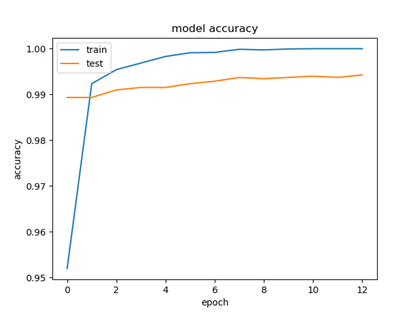
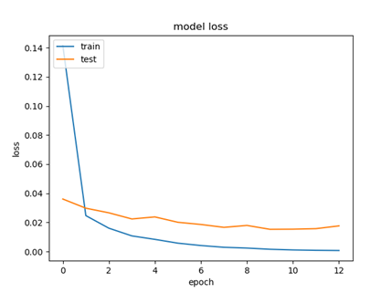
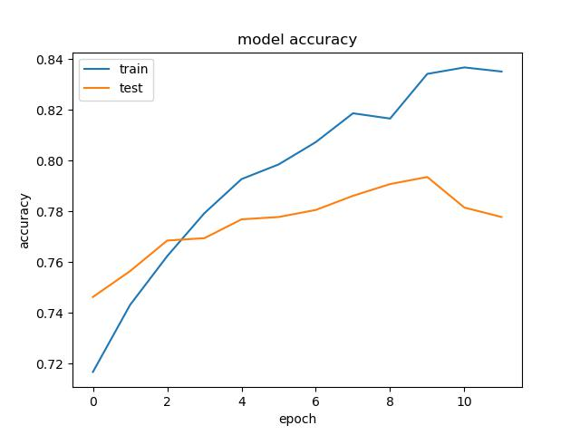
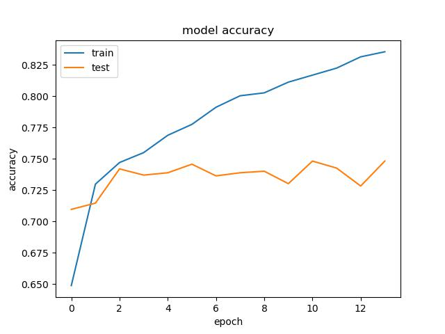

# Bone Fracture Detection with Chatbot Integration

## Overview
This project is built upon the [Bone-Fracture-Detection](https://github.com/Alkoby/Bone-Fracture-Detection) repository, aiming to enhance the model's performance and integrate it with a chatbot for improved user interaction and diagnostic assistance.

---

## Project Structure
```
├── Dataset/                             # (Placeholder) Data directory
├── __pycache__/                         # Python cache files
├── images/                              # Images for README/demo
│   ├── Architecture.png                 
│   ├── NegativeHand.png                 
│   └── PositiveHand.png                 
├── plots/                               # Training evaluation visualizations
│   ├── FractureDetection/
│   ├── BodyPartAcc.png
│   ├── BodyPartLoss.png
│   └── testPredictions.png
├── test/                                # Test image folders
│   ├── Elbow/
│   ├── Hand/
│   └── Shoulder/
├── weights/                             # Pretrained model weights
│   ├── ResNet50_BodyParts.h5
│   ├── ResNet50_Elbow_frac_best.h5
│   ├── ResNet50_Hand_frac_best.h5
│   ├── ResNet50_Shoulder_frac_best.h5
│   ├── ResNet50_Elbow_frac_baseline.h5
│   ├── ResNet50_Hand_frac_baseline.h5
│   └── ResNet50_Shoulder_frac_baseline.h5
├── evaluation.py                        
├── prediction_for_chatbot.py           # Chatbot + fracture classifier integration
├── prediction_test.py                  
├── predictions.py                      
├── requirements.txt                    
├── step-by-step.txt                    # Setup and training guide
├── training_fracture.py                
├── training_parts.py                   
├── main.py                             
└── README.md                           
```

---

## Dataset
We use the **MURA** dataset, which contains musculoskeletal radiographs of three different bone parts: Elbow, Hand, and Shoulder.

| **Part**     | **Normal** | **Fractured** | **Total** |
|--------------|:----------:|--------------:|----------:|
| **Elbow**    |    3160    |          2236 |      5396 |
| **Hand**     |    4330    |          1673 |      6003 |
| **Shoulder** |    4496    |          4440 |      8936 |

The dataset is organized into training and validation folders, with each patient folder containing 1–3 x-ray images of the same bone.

---

## Algorithm
1. **Preprocessing & Augmentation**  
   - Image resizing, normalization, and horizontal flipping.

2. **Step 1: Bone Type Classification**  
   - A **ResNet50** model classifies the image into Elbow, Hand, or Shoulder.

3. **Step 2: Fracture Detection**  
   - A specialized model for each bone type predicts whether it is fractured or not.

This two-stage process improves performance by delegating fracture detection to bone-specific models after classification.

---

## Results

### Architecture


### Body Part Prediction
 

### Fracture Prediction

#### Elbow
 

#### Hand
 

#### Shoulder
 

---

## DEMO

### Positive Case  


### Negative Case  


---

## Installation

### Requirements
- Python v3.7.x
- IDE: PyCharm or any Python IDE

### Install dependencies
```bash
pip install -r requirements.txt
```

### Required packages (from `requirements.txt`)
```
customtkinter~=5.0.3
PyAutoGUI~=0.9.53
PyGetWindow~=0.0.9
Pillow~=8.4.0
numpy~=1.19.5
tensorflow~=2.6.2
keras~=2.6.0
pandas~=1.1.5
matplotlib~=3.3.4
scikit-learn~=0.24.2
colorama~=0.4.5
```

---

## How to Run
```bash
python main.py
```

Or if running GUI:
```bash
python mainGUI.py
```

---

## Training New Models

### Baseline
```python
random_seed = 1
```

### Elbow Best
```python
random_seed = 42
x = tf.keras.layers.Dense(128, activation='relu')(pretrained_model.output)
x = tf.keras.layers.Dropout(0.5)(x)
x = tf.keras.layers.Dense(50, activation='relu')(x)
x = tf.keras.layers.Dropout(0.3)(x)
```

### Hand Best / Shoulder Best
- Reset to baseline
- Use:
```python
AdamW(learning_rate=1e-4, weight_decay=1e-5)
callbacks = tf.keras.callbacks.EarlyStopping(monitor='val_loss', patience=5, restore_best_weights=True)
reduce_lr = ReduceLROnPlateau(monitor='val_loss', factor=0.5, patience=5, min_lr=1e-6, verbose=1)
```

---

## Objectives
- Enhance fracture detection accuracy and training process.
- Integrate chatbot interaction for automated feedback and explanations.
- Enable real-world deployment with a user-friendly interface.

---

## Acknowledgment
Based on [Alkoby/Bone-Fracture-Detection](https://github.com/Alkoby/Bone-Fracture-Detection). Many thanks for the foundational work.

---

## Team

|  |  |
|:--:|:--:|
| **[Caslow Chien](https://github.com/CaslowChien)**<br>[🌐 Website](https://caslowchien.github.io/caslow.github.io/)<br>[💼 LinkedIn](https://www.linkedin.com/in/caslow/)<br>[📧 Email](mailto:caslow@bu.edu) | **Serena Theobald**<br>[📘 Facebook](https://www.facebook.com/yuan0727)<br>[💼 LinkedIn](https://www.linkedin.com/in/jessiechin727/)<br>[📧 Email](mailto:yuan2001@live.com) |
