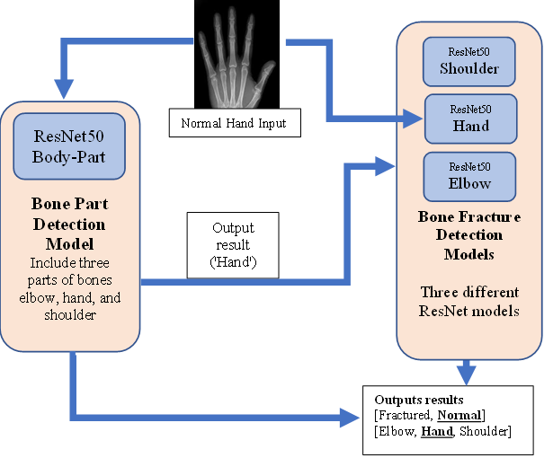
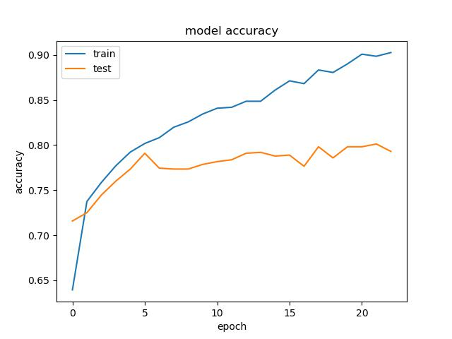

# SkeletaX: The Future of Fracture Care

SkeletaX is an AI-powered assistant that helps users understand bone fractures in the elbow, hand, and shoulder regions. The system provides expert information about symptoms, diagnosis, treatment options, recovery expectations, and allows users to upload X-ray images for AI-assisted analysis.

## Table of Contents
- [Repository Structure](#repository-structure) 
- [Features](#features)
- [System Architecture](#system-architecture)
- [Installation](#installation)
  - [Prerequisites](#prerequisites)
  - [Setup Instructions](#setup-instructions)
- [Usage](#usage)
  - [Text-Based Interface](#text-based-interface)
  - [X-Ray Analysis Interface](#x-ray-analysis-interface)
- [Technical Details](#technical-details)
  - [AI Models](#ai-models)
  - [Dataset](#dataset)
  - [Algorithm](#algorithm)
  - [RAG System](#rag-system)
- [Development](#development)
- [Results](#results)
  - [Body Part Prediction](#body-part-prediction)
  - [Fracture Prediction](#fracture-prediction)
- [Training for New Model](#training-for-new-model)
- [DEMO](#demo)
  - [Positive Case](#positive-case)
  - [Negative Case](#negative-case)


## Repository Structure
```
├── Dataset/                             # (Placeholder) Data directory
├── images/                              # Images for README/demo
│   ├── Architecture.png                 # For model architecture 
│   ├── NegativeHand.png                 # For demo example   
│   └── PositiveHand.png                 # For demo example
├── plots/                               # Training evaluation visualizations
│   ├── FractureDetection/
│   ├── BodyPartAcc.png
│   ├── BodyPartLoss.png
│   └── testPredictions.png
├── test/                                # Test image folders
│   ├── Elbow/
│   ├── Hand/
│   └── Shoulder/
├── weights/                             # Pretrained model weights
│   ├── ResNet50_BodyParts.h5            # Categorize Model
│   ├── ResNet50_Elbow_frac_best.h5    # Elblow detection our best model
│   ├── ResNet50_Hand_frac_best.h5    # Hand detection our best model
│   ├── ResNet50_Shoulder_frac_best.h5    # Shoulder detection our best model
│   ├── ResNet50_Elbow_frac_baseline.h5    # Elblow detection original model (baseline)
│   ├── ResNet50_Hand_frac_baseline.h5    # Hand detection original model (baseline)
│   └── ResNet50_Shoulder_frac_baseline.h5    # Shoulder detection original model (baseline)
├── llm-poc/                             # RAG system implementation
│   ├── app.py                           # Main Gradio interface
│   ├── config.py                        # Configuration settings
│   ├── main.py                          # Database initialization
│   ├── vector_store.py                  # Vector database operations
│   ├── pdf_processing.py                # PDF extraction utilities
│   ├── text_processing.py               # Text chunking and processing
│   └── ollama_llm.py                    # LLM integration
├── evaluation.py                        # Evaluation script for model performance
├── prediction_for_chatbot.py           # Chatbot + fracture classifier integration
├── prediction_test.py                  # Script for testing predictions
├── predictions.py                      # Core prediction module
├── requirements.txt                    # Required Python packages
├── step-by-step.txt                    # Setup and training guide
├── training_fracture.py                # Training script for fracture detection
├── training_parts.py                   # Training script for body part classification
├── positive-hand-fracture-demo.mp4     # Demo for positive hand fracture
├── negative-hand-fracture-demo.mp4     # Demo for negative hand fracture
└── README.md                           # This file
```

## Features

SkeletaX offers two main interfaces:

1. **Text-Based Chat Interface**
   - Ask questions about elbow, hand, or shoulder fractures
   - Get detailed information on symptoms, diagnosis, treatment options, and recovery
   - Receive evidence-based answers from a medical knowledge base

2. **X-Ray Analysis Interface**
   - Upload X-ray images for AI-assisted analysis
   - System identifies the body part (elbow, hand, or shoulder)
   - Provides fracture detection with confidence scores
   - Delivers detailed analysis and relevant medical information

## System Architecture

SkeletaX combines multiple AI technologies:

- **Deep Learning Models** - ResNet50-based models for X-ray image classification
- **Retrieval-Augmented Generation (RAG)** - For accurate medical information retrieval
- **Vector Database** - Stores and retrieves medical information about bone fractures
- **Language Model Integration** - Uses local LLM (Ollama) for natural language processing

## Installation

### Prerequisites

- Python 3.8+
- TensorFlow 2.x
- Gradio
- Ollama (for local LLM)
- pdfplumber
- langchain
- chromadb
- Additional dependencies listed in requirements.txt

### Setup Instructions

1. Clone the repository:
```bash
git clone https://github.com/yourusername/skeletax.git
```

2. Install dependencies:
```bash
pip install -r requirements.txt
```

3. Install Ollama and download the required model:
```bash
# Install Ollama according to instructions at: https://ollama.com/
ollama pull deepseek-r1:1.5b
```

4. Prepare the vector database:
```bash
cd llm-poc
python main.py
```

5. Launch the application:
```bash
python app.py
```

The application will be available at http://localhost:7860

## Usage

### Text-Based Interface

1. Navigate to the "Text Chat" tab
2. Enter your question about elbow, hand, or shoulder fractures
3. Click "Ask Question" or press Enter
4. Review the detailed response from SkeletaX

Example questions:
- "What are the symptoms of an elbow fracture?"
- "How are hand fractures diagnosed?"
- "What treatments are available for shoulder fractures?"
- "How long does it take to recover from a wrist fracture?"

### X-Ray Analysis Interface

1. Navigate to the "X-Ray Analysis" tab
2. Upload an X-ray image of an elbow, hand, or shoulder
3. Enter a specific question about the X-ray
4. Click "Analyze X-Ray"
5. Review the comprehensive analysis report

The report includes:
- Body part identification
- Fracture detection with confidence score
- Expert analysis with relevant medical information
- Treatment suggestions and recovery expectations

## Technical Details

### AI Models

SkeletaX uses several specialized models:
- **Body Part Classifier** - Identifies whether the X-ray shows an elbow, hand, or shoulder
- **Fracture Detectors** - Three specialized models for detecting fractures in each body part
- **Vector Embeddings** - all-MiniLM-L6-v2 for document embeddings
- **Language Model** - deepseek-r1:1.5b for natural language processing

### Dataset
The data set we used called MURA and included 3 different bone parts, MURA is a dataset of musculoskeletal radiographs and contains 20,335 images described below:


| **Part**     | **Normal** | **Fractured** | **Total** |
|--------------|:----------:|--------------:|----------:|
| **Elbow**    |    3160    |          2236 |      5396 |
| **Hand**     |    4330    |          1673 |      6003 |
| **Shoulder** |    4496    |          4440 |      8936 |

The data is separated into train and valid where each folder contains a folder of a patient and for each patient between 1-3 images for the same bone part

### Algorithm
Our data contains about 20,000 x-ray images, including three different types of bones - elbow, hand, and shoulder. After loading all the images into data frames and assigning a label to each image, we split our images into 72% training, 18% validation and 10% test. The algorithm starts with data augmentation and pre-processing the x-ray images, such as flip horizontal. The second step uses a ResNet50 neural network to classify the type of bone in the image. Once the bone type has been predicted, A specific model will be loaded for that bone type prediction from 3 different types that were each trained to identify a fracture in another bone type and used to detect whether the bone is fractured.  

This approach utilizes the strong image classification capabilities of ResNet50 to identify the type of bone and then employs a specific model for each bone to determine if there is a fracture present. Utilizing this two-step process, the algorithm can efficiently and accurately analyze x-ray images, helping medical professionals diagnose patients quickly and accurately.   

The algorithm can determine whether the prediction should be considered a positive result, indicating that a bone fracture is present, or a negative result, indicating that no bone fracture is present. The results of the bone type classification and bone fracture detection will be displayed to the user in the application, allowing for easy interpretation.   

This algorithm has the potential to greatly aid medical professionals in detecting bone fractures and improving patient diagnosis and treatment. Its efficient and accurate analysis of x-ray images can speed up the diagnosis process and help patients receive appropriate care.




### RAG System

The Retrieval-Augmented Generation system works as follows:
1. User query is processed and reformulated for optimal retrieval
2. Vector search identifies the most relevant medical information
3. Context from multiple sources is combined
4. Local LLM generates a comprehensive, accurate response
5. System ensures responses are medically appropriate and evidence-based

## Development

The project structure of `llm-poc`:
- `app.py` - Main Gradio interface
- `config.py` - Configuration settings
- `main.py` - Database initialization
- `vector_store.py` - Vector database operations
- `pdf_processing.py` - PDF extraction utilities
- `text_processing.py` - Text chunking and processing
- `ollama_llm.py` - LLM integration
- `prediction_for_chatbot.py` - X-ray classification

---

## Results
### Body Part Prediction

 

### Fracture Prediction
#### Elbow

 

#### Hand
 

#### Shoulder
 


## Training for New Model

### Baseline (Original Model)
random_seed = 1

### Elbow_best
random_seed = 42
    x = tf.keras.layers.Dense(128, activation='relu')(pretrained_model.output)
    x = tf.keras.layers.Dropout(0.5)(x)
    x = tf.keras.layers.Dense(50, activation='relu')(x)
    x = tf.keras.layers.Dropout(0.3)(x)


### Hand_best
reset to baseline

AdamW(learning_rate=1e-4, weight_decay=1e-5)
callbacks = tf.keras.callbacks.EarlyStopping(monitor='val_loss', patience=5, restore_best_weights=True)
reduce_lr = ReduceLROnPlateau(monitor='val_loss', factor=0.5, patience=5, min_lr=1e-6, verbose=1)

### Shoulder_best
reset to baseline

AdamW(learning_rate=1e-4, weight_decay=1e-5)
callbacks = tf.keras.callbacks.EarlyStopping(monitor='val_loss', patience=5, restore_best_weights=True)
reduce_lr = ReduceLROnPlateau(monitor='val_loss', factor=0.5, patience=5, min_lr=1e-6, verbose=1)

## DEMO
### Positive Case


### Negative Case


**Disclaimer**: SkeletaX is designed as an educational and informational tool only. It is not intended to replace professional medical advice, diagnosis, or treatment. Always seek the advice of qualified healthcare providers with any questions regarding medical conditions.

## Team
<div align="center">
  <table>
    <tr>
      <td align="center">
        <a href="https://github.com/CaslowChien">
          
          <br />
          <b>Caslow Chien</b>
        </a>
        <a href="https://caslowchien.github.io/portfolio/" target="_blank">
          
        </a> 
        <a href="https://www.linkedin.com/in/caslow/" target="_blank">
          
        </a>
        <a href="mailto:caslow@bu.edu" target="_blank">
          
        </a>
      </td>
     <td align="center">
        <a href="https://github.com/">
          
          <br />
          <b>Serena Theobald</b>
        </a>
        <a href="https://www.facebook.com/yuan0727" target="_blank">
          
        </a> 
        <a href="https://www.linkedin.com/in/jessiechin727/" target="_blank">
          
        </a>
        <a href="mailto:yuan2001@live.com" target="_blank">
          
        </a>
      </td>
      <td align="center">
        <a href="https://github.com/sins42">
          
          <br />
          <b>Sindhuja Kumar</b>
        </a>
        <a href="https://www.linkedin.com/in/sindhuja-kumar/" target="_blank">
          
        </a>
        <a href="mailto:sins@bu.edu" target="_blank">
          
        </a>
    </tr>
  </table>
</div>

## License
This project is released under MIT license.
